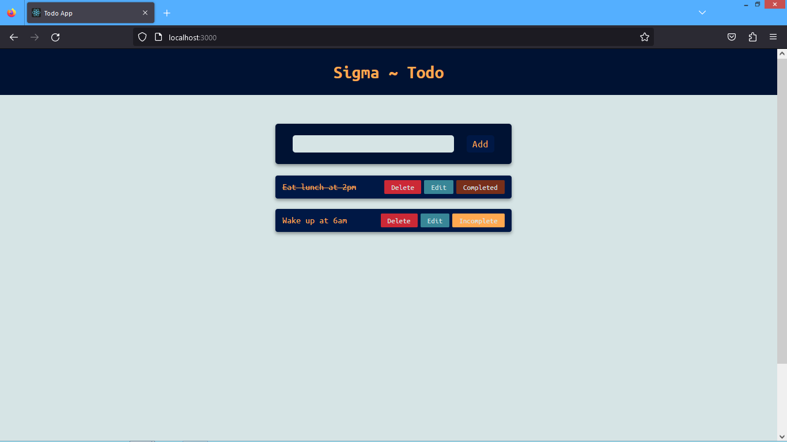

#  Building a Todo App with the MERN Stack: A Complete Guide 
 In today's fast-paced world, staying organized and managing tasks efficiently is crucial. That's where a Todo application comes to the rescue. In this blog post, we will explore how to build a Todo app using the MERN stack. MERN stands for MongoDB, Express.js, React, and Node.js, which together provide a powerful and efficient framework for full-stack web development. So, let's dive in and discover the steps involved in creating a feature-rich Todo app.
 
 

# Requirements

``` npm
  npm install express cors dotenv mongoose
```

# Packages and modules
    * Vite (Frontend Development Tool)
    * React Js (Frontend Framework)
    * Node Js and Express Js(Backend Development)
    * MongoDB (For Database) 
    * Cors (Package to working with frontend and backend correspondingly)
    * Axios (To Fetch data from the database)
    * dotenv (To store sensitive data)

Read the Blog: [Building a Todo App with the MERN Stack: A Complete Guide](https://webkettle.blogspot.com/2023/06/building-todo-app-with-mern-stack.html)
